# LeetMentor


LeetMentor is a local LeetCode workflow assistant. The point is not to dump a problem into ChatGPT, wait for a giant answer, and copy the final code back. The point is to stay inside one workspace, ask for only the help you need, and understand the pattern through hints, review, complexity, and optimization.

## Core Workflow

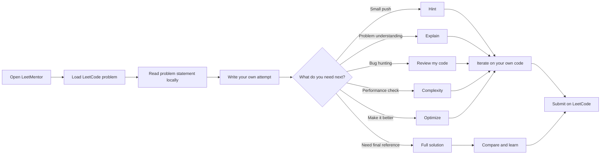

## Why This Exists

```mermaid
flowchart TB
    subgraph Old_Flow["Copy-paste AI flow"]
        A1[Open LeetCode] --> A2[Copy problem]
        A2 --> A3[Paste into ChatGPT]
        A3 --> A4[Copy your code]
        A4 --> A5[Paste again]
        A5 --> A6[Read long answer]
        A6 --> A7[Copy AI code back]
    end

    subgraph New_Flow["LeetMentor flow"]
        B1[Load problem] --> B2[Code locally]
        B2 --> B3[Ask for exact help]
        B3 --> B4[Learn through hints, review, and optimization]
        B4 --> B5[Submit with understanding]
    end
```

Short version:

- less tab switching
- less copy-paste friction
- more learning from your own attempt
- easier use of hints instead of instant full answers

## Mentor Decision Tree

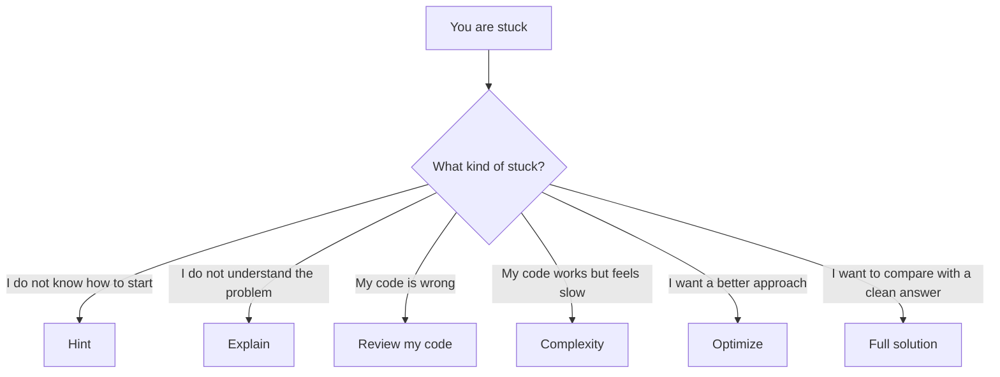

## Request Flow

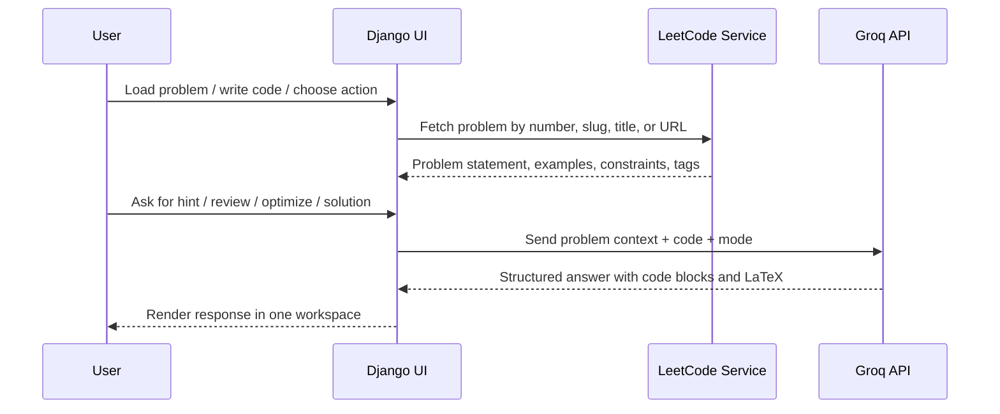

## Product Shape

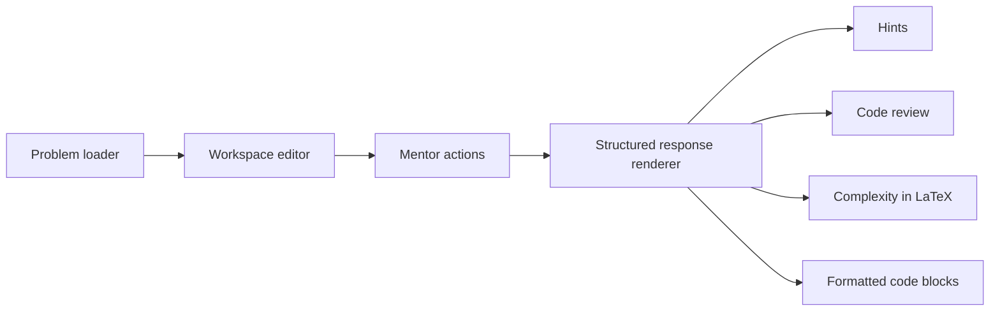

## What The App Does

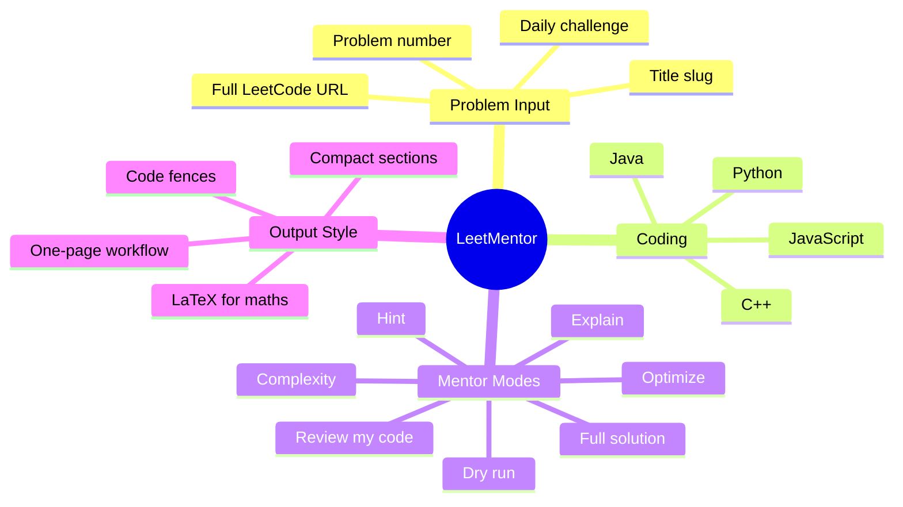

## API Requirement

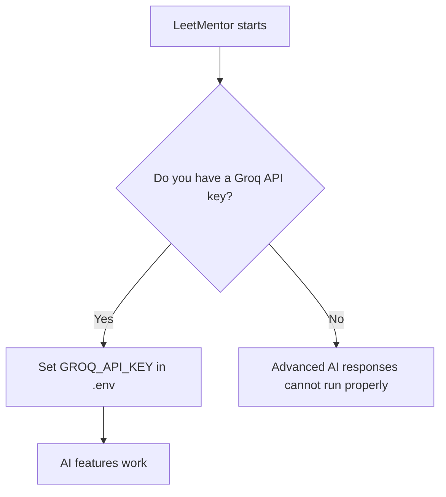

This project needs your own API key. It does not include a built-in unlimited AI service.

You need:

- a Groq account
- a `GROQ_API_KEY`
- an `AI_MODEL` value

## Setup

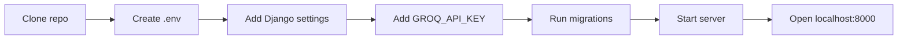

Use this `.env`:

```env
DJANGO_SECRET_KEY=replace_me
DJANGO_DEBUG=true
DJANGO_ALLOWED_HOSTS=127.0.0.1,localhost
GROQ_API_KEY=your_groq_api_key_here
AI_MODEL=llama-3.3-70b-versatile
LEETCODE_GRAPHQL_URL=https://leetcode.com/graphql
```

Run:

```bash
python manage.py migrate
python manage.py runserver
```

Open:

```text
http://127.0.0.1:8000
```

## Recommended Usage Pattern

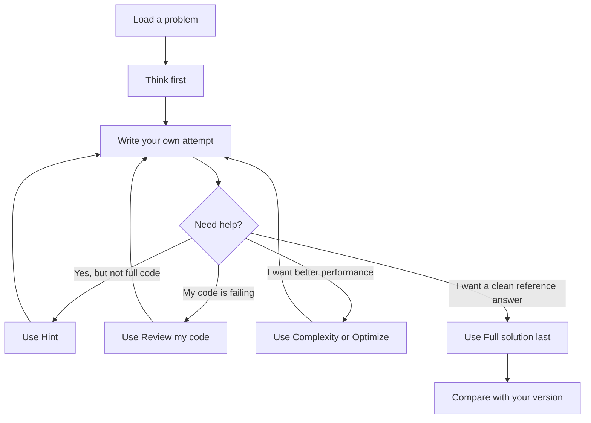

## Repository Map

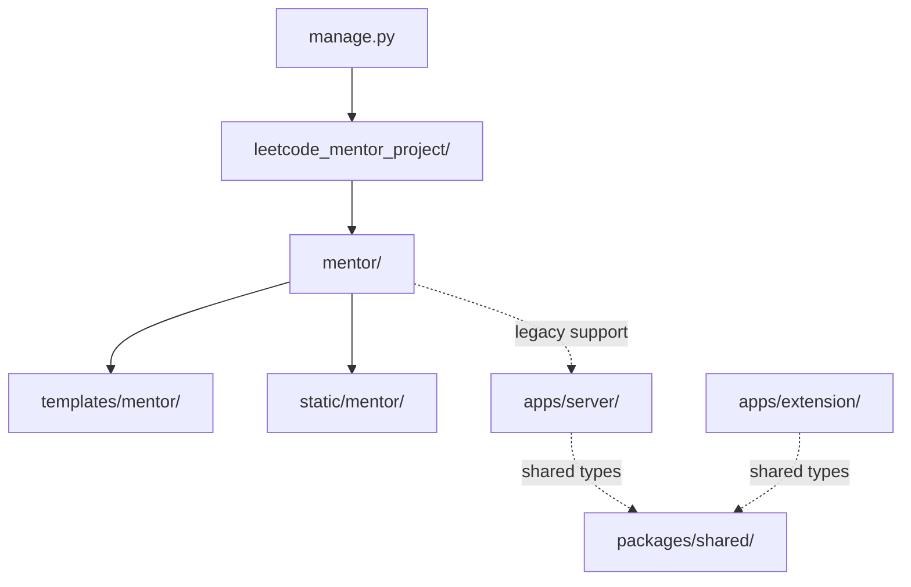

## Practical Theory

LeetMentor is best when you use it like a study partner, not like a code vending machine.

- `Hint` is for momentum.
- `Review my code` is for debugging your own logic.
- `Complexity` and `Optimize` are for pushing from accepted to strong.
- `Full solution` is most useful after you already tried.

If you skip straight to the final solution every time, you will finish problems. If you loop through hints, review, and optimization, you will build actual interview skill.

## Current Stack

- Django backend and UI
- Groq API for AI responses
- LeetCode GraphQL for problem data
- SQLite locally
- LaTeX rendering through MathJax

## Good Next Improvements

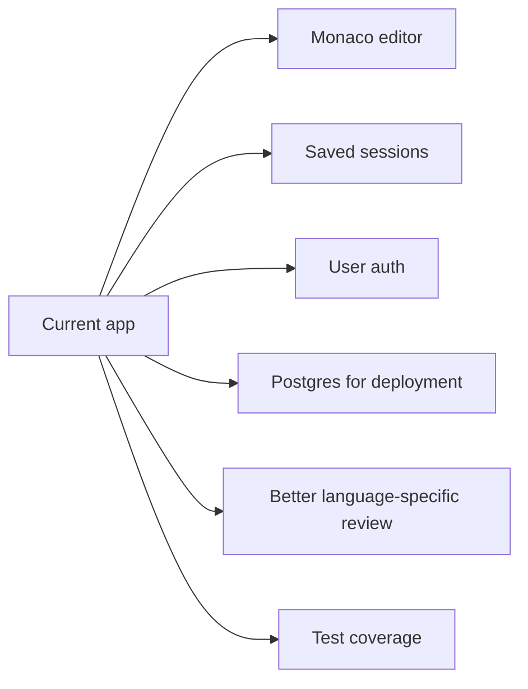
