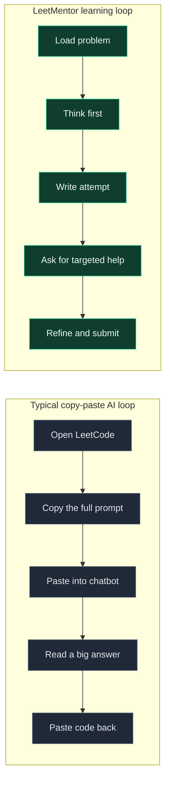
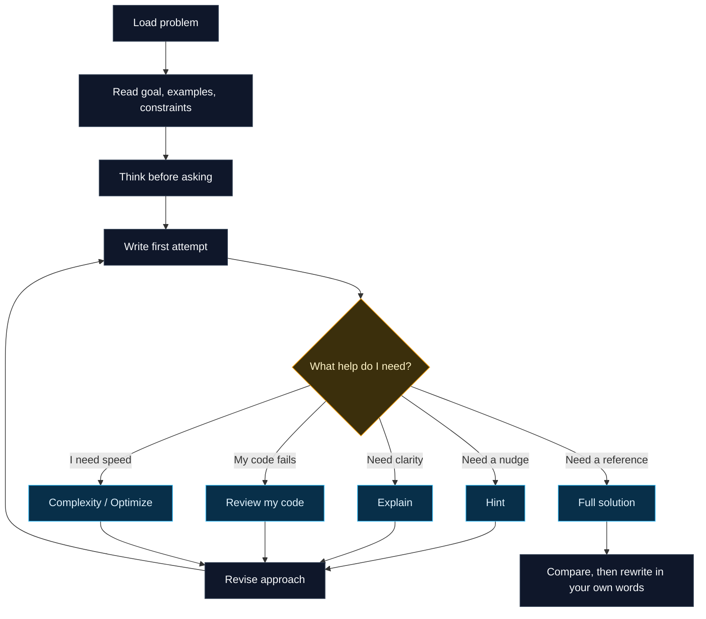
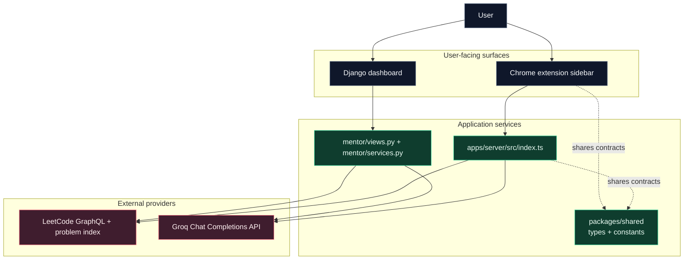
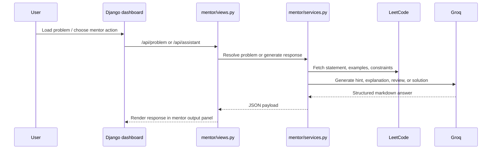
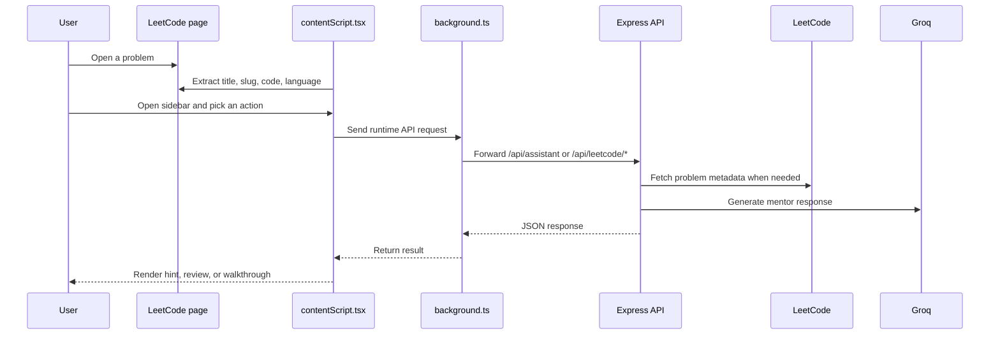
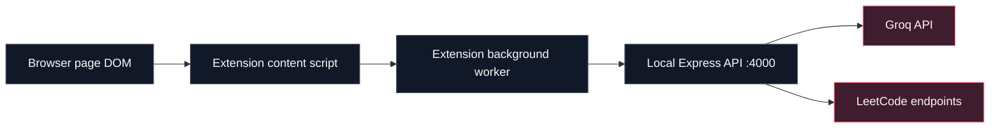
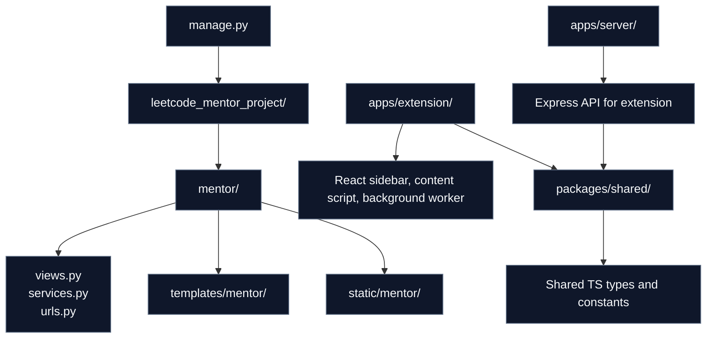
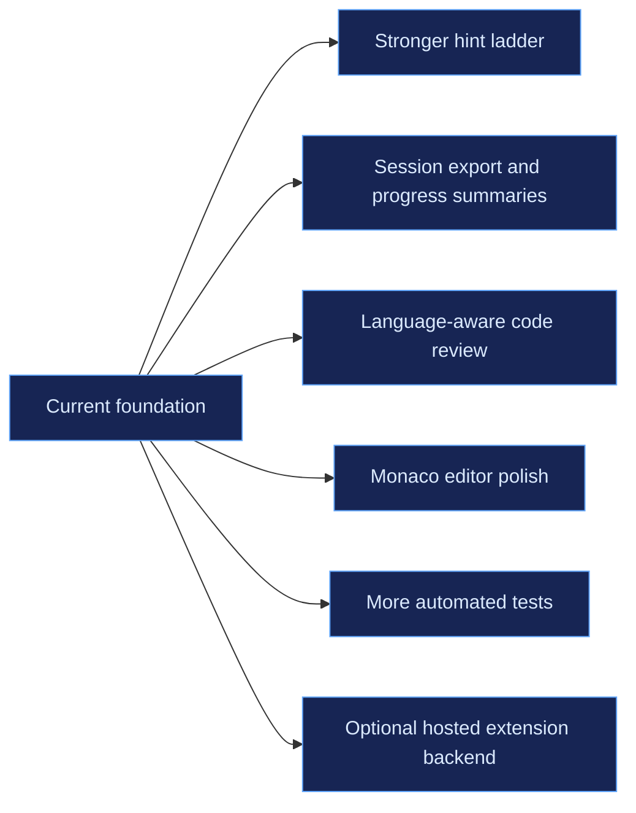

<p align="center">
  
</p>

<h1 align="center">LeetMentor</h1>

<p align="center">
  Guided LeetCode practice for people who want to learn the pattern, not just copy the answer.
</p>

<p align="center">
  <a href="https://leetmentor-1ya8.onrender.com">Live demo</a> |
  <a href="#architecture">Architecture</a> |
  <a href="#data-flow">Data Flow</a> |
  <a href="#local-setup">Local Setup</a>
</p>

<p align="center">
  
  
  
  
</p>

## Overview

LeetMentor keeps the full problem-solving loop in one workspace:

- load a LeetCode problem
- think before asking for help
- write your own attempt
- request the smallest useful intervention
- revise until the pattern clicks

It currently ships in two surfaces that share the same teaching philosophy:

| Surface | Best for | Main stack |
| --- | --- | --- |
| Web dashboard | Full-screen study sessions with problem, code, and mentor output side by side | Django, HTML, CSS, JS |
| Chrome extension | In-context practice directly on the LeetCode page | React, TypeScript, Express |

Both surfaces now keep drafts scoped to the current problem and language. The extension also keeps a capped chat history per problem, while the web dashboard supports focused questions, copyable mentor output, and `Ctrl`/`⌘` + `Enter` shortcuts.

The Django dashboard also includes a session-scoped Learning Review System: students save their progress checkpoint, confidence, main mistake, and reflection for each problem. Solved problems automatically enter a spaced revision queue scheduled after 1, 3, 7, 21, and 45 days.

## Why This Exists



The point is not just convenience. The product is trying to preserve productive struggle, reduce context switching, and make hints feel like coaching instead of answer vending.

## Experience Model

### Mentor Actions

| Action | When to use it | What it should do |
| --- | --- | --- |
| `Hint` | You are blocked but still want to solve it yourself | Nudge the next move without dumping code |
| `Explain` | The statement or constraints are unclear | Rephrase the task in simpler words |
| `Review my code` | You already wrote an attempt | Find the exact bug or reasoning mistake |
| `Complexity` | Your code works, but you doubt the efficiency | Compare current vs target complexity |
| `Optimize` | You want the better pattern | Explain the upgrade path |
| `Dry run` | You need to see state changes on real input | Walk through one example clearly |
| `Full solution` | You already tried and now want a clean reference | Show the optimal approach last |

### Study Loop



### Learning Review Loop

1. Load a problem and make an honest attempt.
2. Save the current checkpoint, confidence, and main mistake.
3. Write one short reflection about what to try first next time.
4. Once the problem is solved, revisit it from the revision queue.
5. Mark the revision complete to schedule the next interval.

Learning records are stored by Django and isolated to the anonymous browser session. No account is required for local practice.

## Architecture

LeetMentor is one product with two delivery surfaces:

- the Django app is the standalone study dashboard
- the extension stack is a React sidebar plus a local Express API
- both surfaces fetch LeetCode problem data and generate mentor responses



## Data Flow

### Web Dashboard Request Flow



### Extension Request Flow



### Runtime Boundaries



## Repository Layout



## Local Setup

### 1. Python workspace

```bash
pip install -r requirements.txt
```

Create a `.env` file in the repo root:

```env
DJANGO_SECRET_KEY=replace_me
DJANGO_DEBUG=true
DJANGO_ALLOWED_HOSTS=127.0.0.1,localhost
GROQ_API_KEY=your_groq_api_key_here
AI_MODEL=llama-3.3-70b-versatile
LEETCODE_GRAPHQL_URL=https://leetcode.com/graphql
```

Run the Django app:

```bash
python manage.py migrate
python manage.py runserver
```

Open `http://127.0.0.1:8000`.

### 2. Node workspaces

Install dependencies for the extension stack:

```bash
npm install
```

Start the local API used by the Chrome extension:

```bash
npm run dev:server
```

This serves the extension backend at `http://localhost:4000`.

The server binds to `127.0.0.1` by default. Set `HOST` only when you intentionally need another interface, and use a comma-separated `CORS_ORIGIN` allowlist for any non-local web clients. Chrome extension origins and local development origins are handled automatically.

### 3. Extension build

Run the extension dev build:

```bash
npm run dev:extension
```

## API Surfaces

### Django app

| Route | Purpose |
| --- | --- |
| `/api/health/` | Health check |
| `/api/daily/` | Fetch the daily challenge |
| `/api/problem/?identifier=...` | Resolve a problem by number, slug, title, or URL |
| `/api/study/` | Save a learning review or load the session revision queue |
| `/api/assistant/` | Generate mentor output for the web dashboard |

### Extension API

| Route | Purpose |
| --- | --- |
| `/api/leetcode/daily` | Daily challenge for the extension |
| `/api/leetcode/problem/:identifier` | Problem lookup for the extension |
| `/api/assistant/chat` | Mentor chat endpoint for the sidebar |

## Environment Notes

- `GROQ_API_KEY` is required for rich AI-generated responses.
- Without that key, some local fallback logic still helps with hints or guardrails, but the full mentor experience is limited.
- `AI_MODEL` defaults to `llama-3.3-70b-versatile`.
- The extension and the Django dashboard are separate runtimes, so deploying the web app does not automatically deploy the extension backend.
- `ASSISTANT_RATE_LIMIT` controls the Django dashboard's per-session request allowance (default: 20 requests per five minutes).
- Invalid modes, oversized payloads, malformed provider data, and untrusted browser origins are rejected before they can reach the AI provider.

## Verification

Run the full local verification set with:

```bash
npm run typecheck
npm run build
python manage.py test
python manage.py check
```

The Django suite covers endpoint validation, rate limiting, problem parsing, and safe offline guidance. The TypeScript build validates the server, shared contracts, popup/options UI, and loadable extension content-script bundle.

## Deployment

The repository already includes production-oriented Django deployment pieces:

- `gunicorn` as the app server
- `whitenoise` for static assets
- optional `DATABASE_URL` support
- `build.sh` for build steps
- `render.yaml` for a Render blueprint

### Recommended path: Render

1. Push the repository to GitHub.
2. Create a new Blueprint in Render from the repo.
3. Add the missing secret: `GROQ_API_KEY`.
4. Deploy.

The included blueprint provisions:

- one Python web service
- one PostgreSQL database

Important production variables:

```env
DJANGO_DEBUG=false
DJANGO_SECRET_KEY=generate_a_new_production_secret
GROQ_API_KEY=your_real_groq_key
AI_MODEL=llama-3.3-70b-versatile
```

`DATABASE_URL` is supplied automatically when you use the included Render blueprint.

Manual commands:

```bash
./build.sh
gunicorn leetcode_mentor_project.wsgi:application --bind 0.0.0.0:$PORT
```

## Current Stack

- Django for the standalone coding workspace
- HTML, CSS, and vanilla JS for the dashboard shell
- React and TypeScript for the Chrome extension UI
- Express for the extension API
- Groq for mentor responses
- LeetCode GraphQL and problem index endpoints for problem data
- SQLite locally, with PostgreSQL support in deployment
- shared TypeScript contracts in `packages/shared`

## Roadmap



## Bottom Line

LeetMentor is designed to keep students inside the real interview-prep loop: read, think, code, ask, revise, and understand. The README should reflect that same idea, so the docs now explain both the teaching model and the actual system boundaries clearly enough for a contributor, reviewer, or recruiter to understand the product fast.
