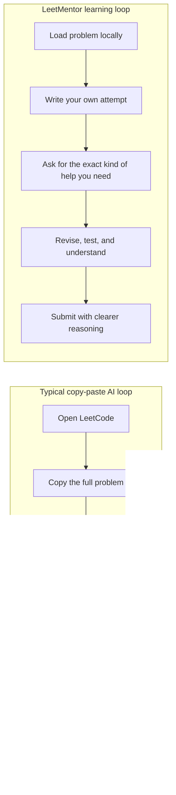
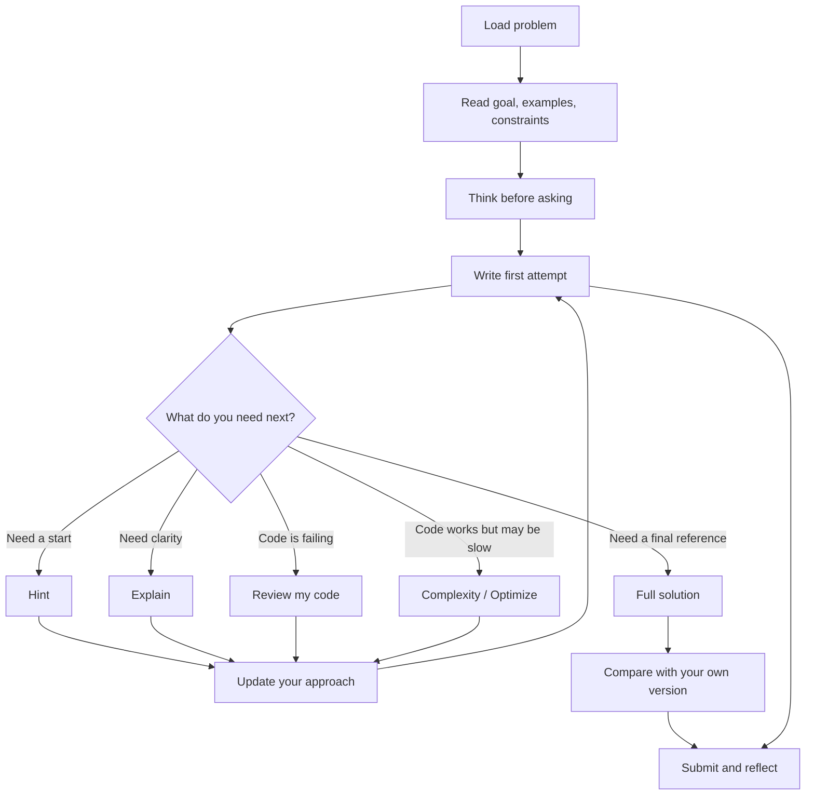
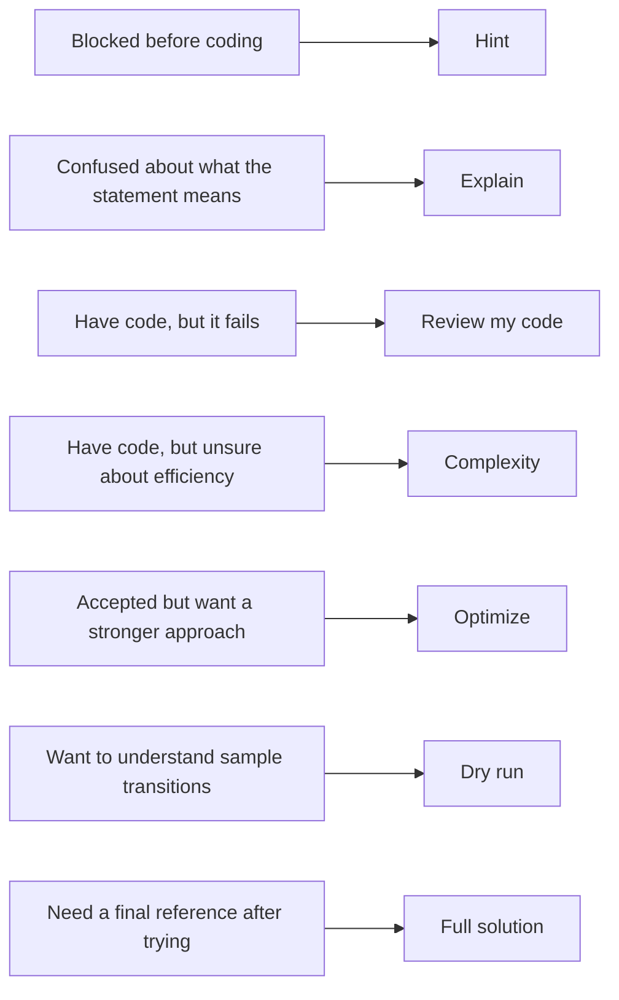
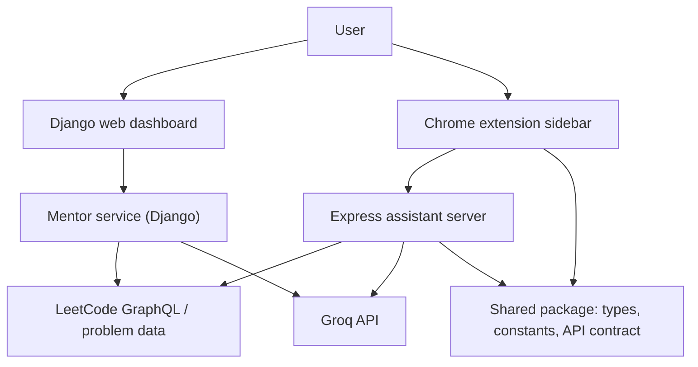
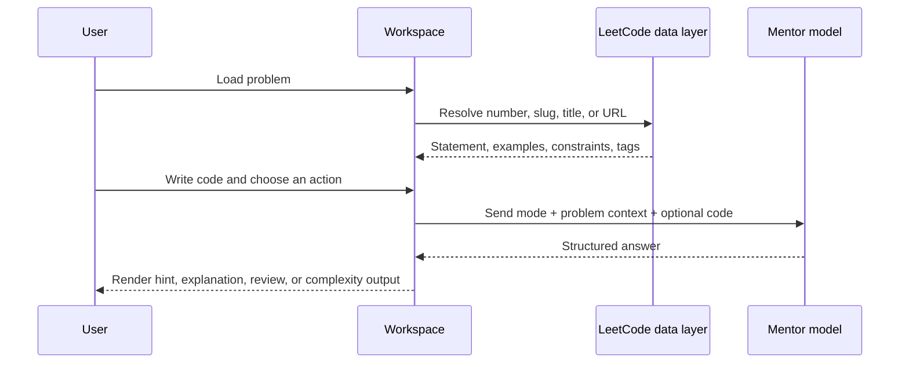
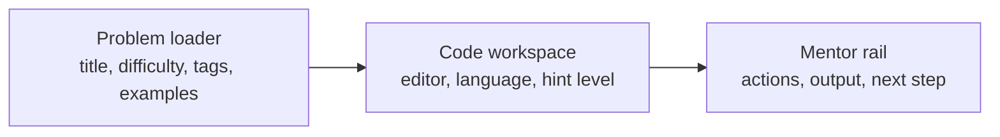
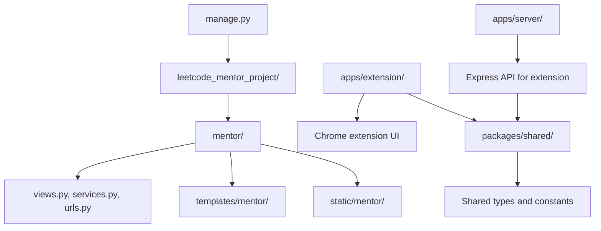
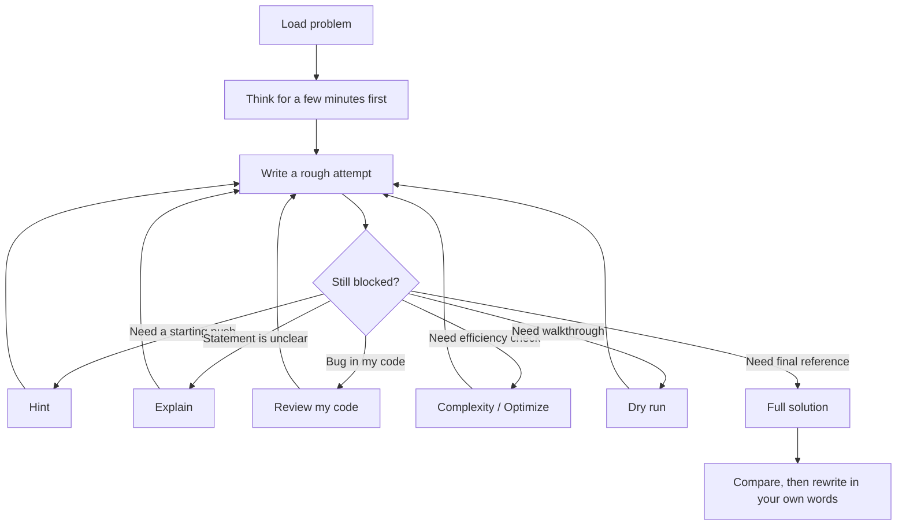
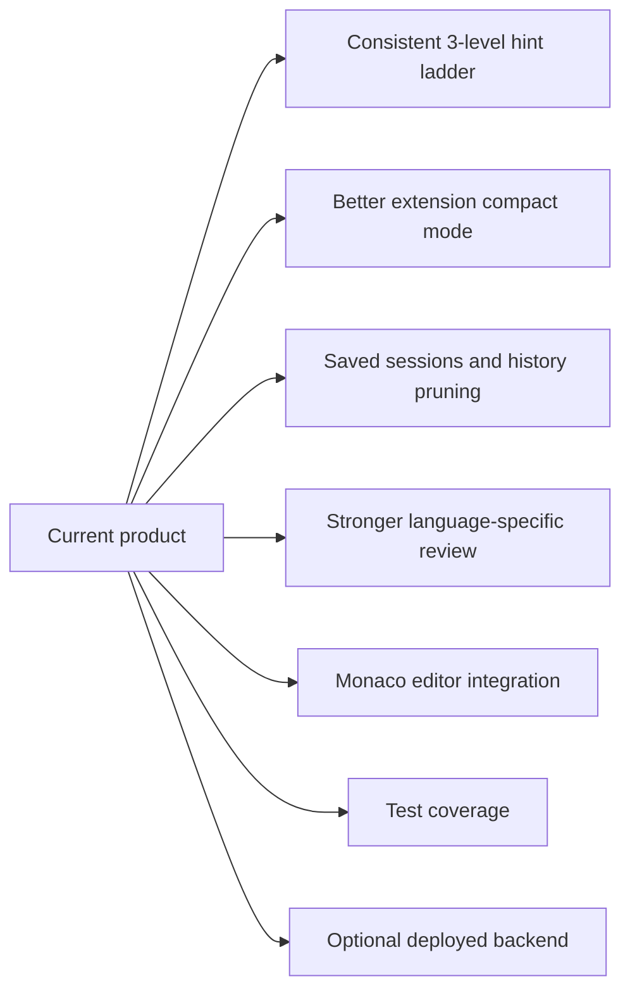

# LeetMentor

LeetMentor is a local LeetCode practice workspace built for guided learning, not answer vending.

Live website:

- [https://leetmentor-1ya8.onrender.com](https://leetmentor-1ya8.onrender.com)

Instead of copying a problem into a chatbot, waiting for a long reply, and pasting code back into LeetCode, the product keeps the full study loop in one place:

- load a problem
- think first
- write your own attempt
- ask for the smallest useful kind of help
- iterate until you understand the pattern

## What It Is

LeetMentor currently has two surfaces:

- a Django web dashboard for a full-screen coding workspace
- a Chrome extension sidebar for in-context practice on the LeetCode page

The core assistant can:

- explain a problem in simpler terms
- give progressive hints
- review your code
- discuss complexity
- run through samples
- compare approaches
- provide a full solution when you explicitly want one

## Learning Model

The product is designed around four learning principles:

1. Productive struggle matters.
   A small amount of difficulty is useful because it forces pattern recognition, recall, and decision-making.

2. Help should be progressive.
   A directional nudge is better than a complete answer when the student is still capable of solving the problem.

3. Review beats replacement.
   Debugging your own attempt teaches more than reading a fresh solution from scratch.

4. Full solutions should come late.
   The clean solution is most valuable after the student has already formed and tested a mental model.

## Why It Exists



The difference is not only convenience. It changes the user's behavior:

- less tab switching
- less context loss
- less temptation to jump straight to the final code
- more repetition of the actual interview skill loop

## Core Study Loop



## Mentor Actions Explained

Each action exists for a different stage of the learning process.



### Hint

Use hint mode when you still want to solve the problem yourself.

The ideal hint system is progressive:

- level 1 should help you start
- level 2 should guide the decision flow
- level 3 should describe the solving algorithm without dumping full code

### Explain, Review, and Full Solution

- `Explain` is for understanding the statement, rules, and tricky wording.
- `Review my code` is the highest-leverage mode because it improves your own reasoning instead of replacing it.
- `Complexity`, `Optimize`, and `Dry run` help when your idea exists but needs sharpening.
- `Full solution` is best used last, after you already tried and want a clean reference.

## System Architecture



## Request Lifecycle



## Workspace Shape

The web dashboard is designed as a three-zone study surface:

- left rail for problem context
- center for the code editor
- right rail for mentor actions and responses



The extension serves a different purpose. It is meant to stay close to the live LeetCode page and provide:

- quick action access
- live code pickup
- compact mentor responses
- a lower-friction debugging loop

## Repository Map



## Setup

### 1. Python workspace

Install dependencies:

```bash
pip install -r requirements.txt
```

Create a `.env` file:

```env
DJANGO_SECRET_KEY=replace_me
DJANGO_DEBUG=true
DJANGO_ALLOWED_HOSTS=127.0.0.1,localhost
GROQ_API_KEY=your_groq_api_key_here
AI_MODEL=llama-3.3-70b-versatile
LEETCODE_GRAPHQL_URL=https://leetcode.com/graphql
```

Run migrations and start the Django app:

```bash
python manage.py migrate
python manage.py runserver
```

Open:

```text
http://127.0.0.1:8000
```

### 2. Node workspace for the extension backend

Install dependencies:

```bash
npm install
```

Start the extension API server:

```bash
npm run dev:server
```

This runs the assistant backend used by the Chrome extension on:

```text
http://localhost:4000
```

### 3. Extension build

Build the extension workspace:

```bash
npm run dev:extension
```

## API Requirement

The project expects your own Groq API key. It does not ship with a built-in hosted AI plan.

You need:

- a Groq account
- a `GROQ_API_KEY`
- an `AI_MODEL` value

Without that key, rich mentor responses will be limited or unavailable depending on the surface.

## Recommended Usage Pattern



## Current Stack

- Django for the local web app
- Express for the extension backend
- React in the extension UI
- Groq API for mentor responses
- LeetCode GraphQL for problem data
- SQLite for local Django persistence
- MathJax for LaTeX rendering in formatted mentor output

## Near-Term Improvements



## Deploying The Django App

The easiest first deployment target is the Django dashboard.

This repository is now set up for production-style deployment with:

- `gunicorn` as the app server
- `whitenoise` for static file serving
- optional `DATABASE_URL` support for PostgreSQL
- a `build.sh` build script
- a `render.yaml` blueprint for Render

### Recommended first path: Render

1. Push the repository to GitHub.
2. In Render, create a new Blueprint from the repository.
3. Add the missing secret:

```text
GROQ_API_KEY
```

4. Deploy.

Current live deployment:

- [https://leetmentor-1ya8.onrender.com](https://leetmentor-1ya8.onrender.com)

The included blueprint creates:

- one Python web service
- one PostgreSQL database

### Important production environment variables

Set these in the hosting dashboard, not in source control:

```env
DJANGO_DEBUG=false
DJANGO_SECRET_KEY=generate_a_new_production_secret
GROQ_API_KEY=your_real_groq_key
AI_MODEL=llama-3.3-70b-versatile
```

`DATABASE_URL` is supplied automatically by Render when you use the included `render.yaml`.

### Manual deploy commands

Build command:

```bash
./build.sh
```

Start command:

```bash
gunicorn leetcode_mentor_project.wsgi:application --bind 0.0.0.0:$PORT
```

### Extension note

The Chrome extension backend is separate from the Django dashboard. You can deploy the Django app first and deploy the Node extension API later as a second service if you want the full extension setup online too.

## Bottom Line

LeetMentor is not meant to be a generic chatbot wrapped around LeetCode. It is meant to be a practice environment where you can think, code, ask for targeted help, and build actual problem-solving skill without leaving the workflow.
