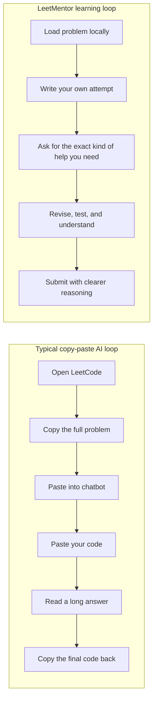
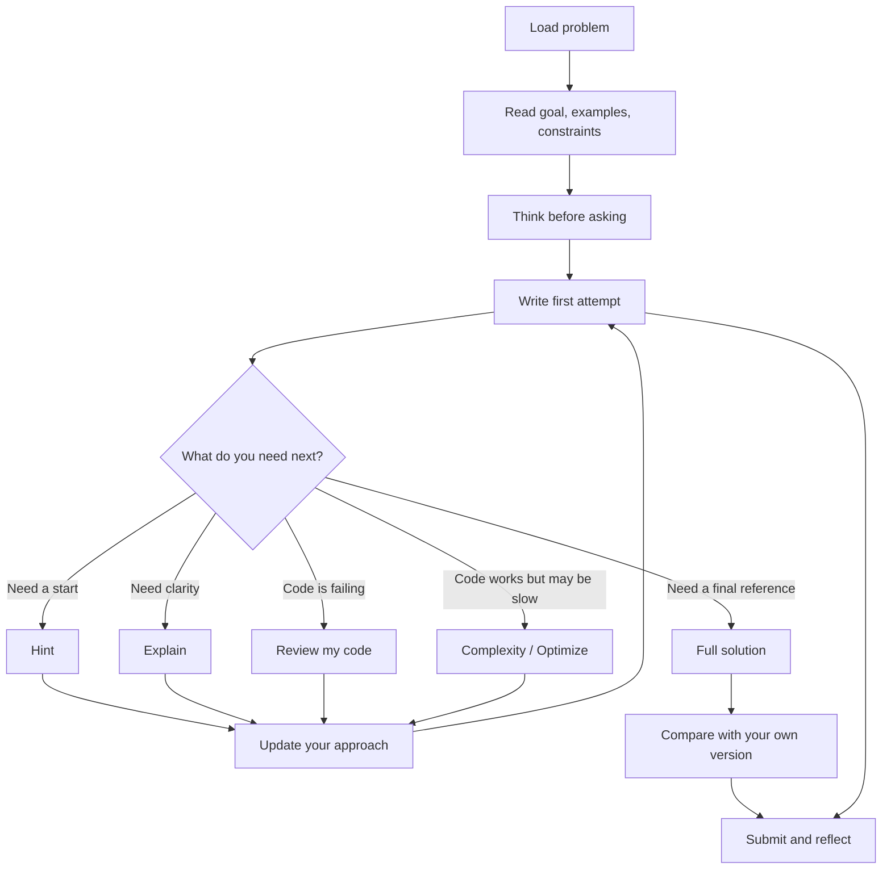
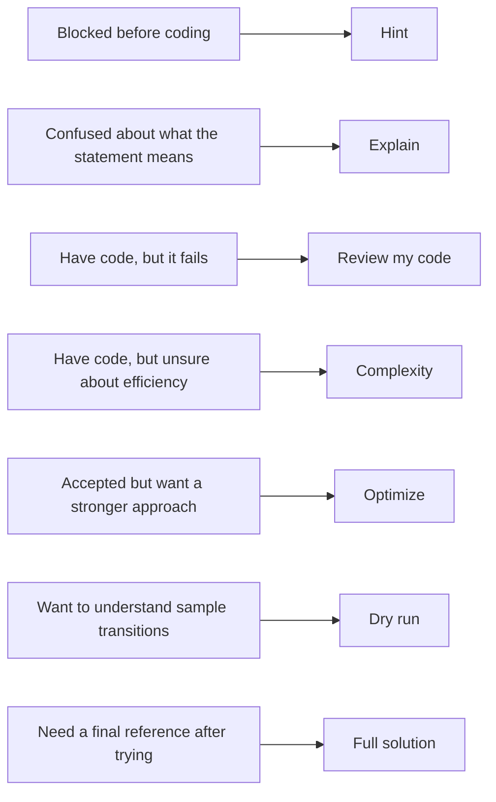
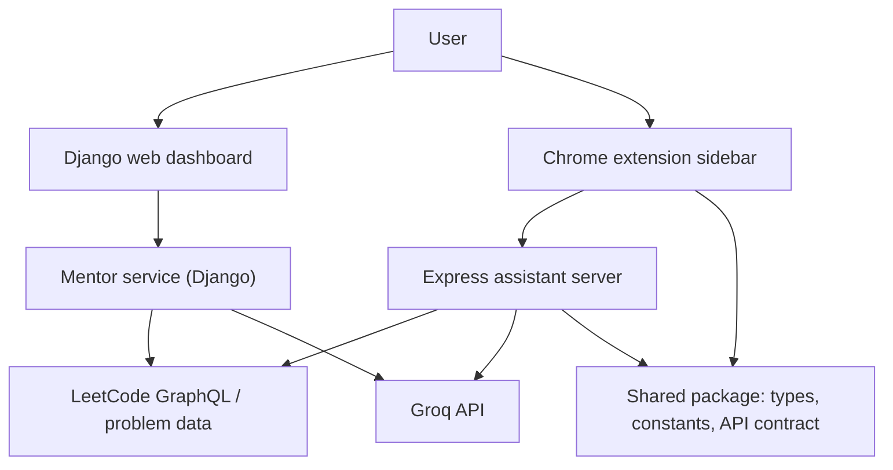
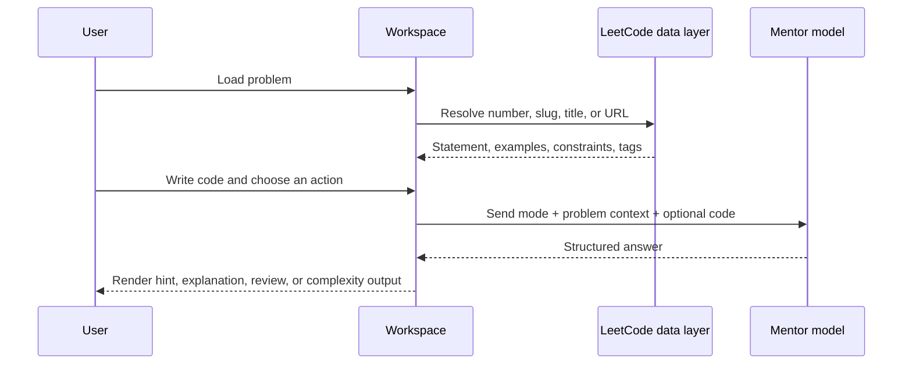
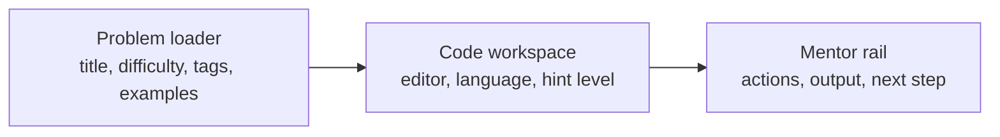
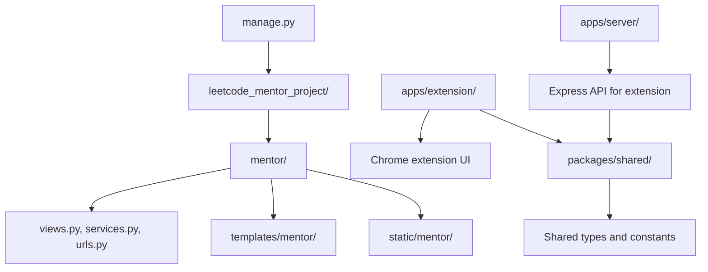
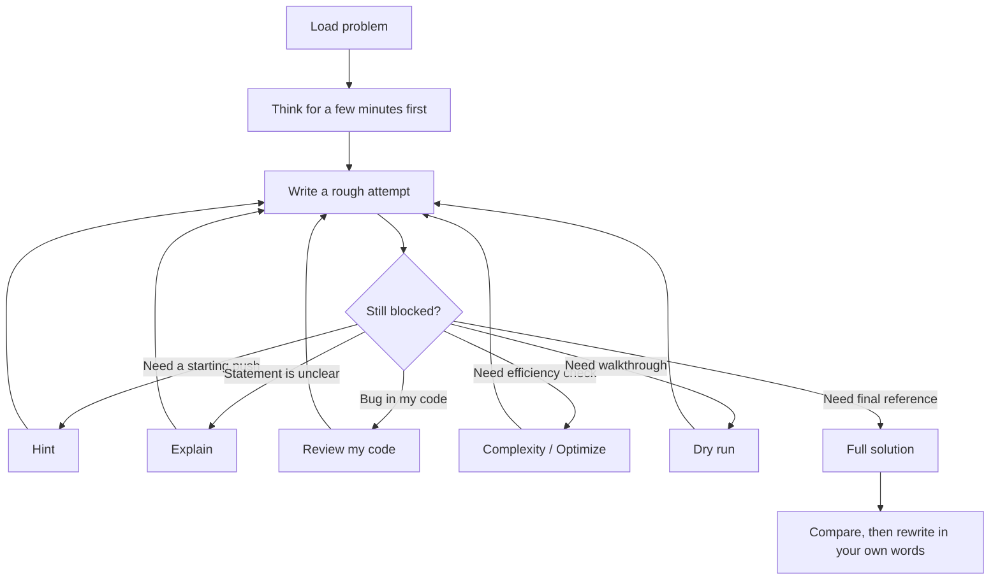
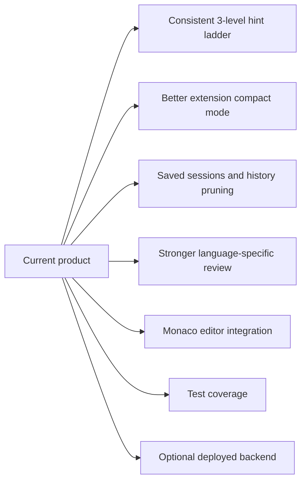

# LeetMentor

LeetMentor is a local LeetCode practice workspace built for guided learning, not answer vending.

Instead of copying a problem into a chatbot, waiting for a long reply, and pasting code back into LeetCode, the product keeps the full study loop in one place:

- load a problem
- think first
- write your own attempt
- ask for the smallest useful kind of help
- iterate until you understand the pattern

## What It Is

LeetMentor currently has two surfaces:

- a Django web dashboard for a full-screen coding workspace
- a Chrome extension sidebar for in-context practice on the LeetCode page

The core assistant can:

- explain a problem in simpler terms
- give progressive hints
- review your code
- discuss complexity
- run through samples
- compare approaches
- provide a full solution when you explicitly want one

## Product Thesis

Most AI-assisted coding flows remove the exact friction that helps people learn.

That sounds convenient, but it often trains the wrong behavior:

- ask too early
- read passively
- trust the answer before testing your own reasoning
- optimize for completion instead of understanding

LeetMentor is based on a different idea: the tool should support the student's reasoning, not replace it.

## Learning Model

The product is designed around four learning principles:

1. Productive struggle matters.
   A small amount of difficulty is useful because it forces pattern recognition, recall, and decision-making.

2. Help should be progressive.
   A directional nudge is better than a complete answer when the student is still capable of solving the problem.

3. Review beats replacement.
   Debugging your own attempt teaches more than reading a fresh solution from scratch.

4. Full solutions should come late.
   The clean solution is most valuable after the student has already formed and tested a mental model.

## Why It Exists



The difference is not only convenience. It changes the user's behavior:

- less tab switching
- less context loss
- less temptation to jump straight to the final code
- more repetition of the actual interview skill loop

## Core Study Loop



## Mentor Actions Explained

Each action exists for a different stage of the learning process.



### Hint

Use hint mode when you still want to solve the problem yourself.

The ideal hint system is progressive:

- level 1 should help you start
- level 2 should guide the decision flow
- level 3 should describe the solving algorithm without dumping full code

### Explain

Use explain mode when the statement itself is the blocker.

This is for:

- understanding the real goal
- clarifying rules
- unpacking tricky wording
- reading a smaller example in plain language

### Review My Code

Use review mode after you have an honest attempt.

This is the highest-leverage mode for learning because it forces the assistant to work on your reasoning instead of replacing it.

### Complexity

Use complexity mode when your logic works but you want to know whether it is strong enough for interviews or large inputs.

### Optimize

Use optimize mode when you want to improve the accepted version into a cleaner or more efficient one.

### Dry Run

Use dry run mode when you know the broad idea but lose track of state changes, pointer moves, or transitions.

### Full Solution

Use the full solution last, not first.

It is most useful when:

- you already tried
- you want to compare structure
- you want to confirm the standard accepted pattern

## System Architecture



## Request Lifecycle



## Workspace Shape

The web dashboard is designed as a three-zone study surface:

- left rail for problem context
- center for the code editor
- right rail for mentor actions and responses



The extension serves a different purpose. It is meant to stay close to the live LeetCode page and provide:

- quick action access
- live code pickup
- compact mentor responses
- a lower-friction debugging loop

## Repository Map



## Setup

### 1. Python workspace

Install dependencies:

```bash
pip install -r requirements.txt
```

Create a `.env` file:

```env
DJANGO_SECRET_KEY=replace_me
DJANGO_DEBUG=true
DJANGO_ALLOWED_HOSTS=127.0.0.1,localhost
GROQ_API_KEY=your_groq_api_key_here
AI_MODEL=llama-3.3-70b-versatile
LEETCODE_GRAPHQL_URL=https://leetcode.com/graphql
```

Run migrations and start the Django app:

```bash
python manage.py migrate
python manage.py runserver
```

Open:

```text
http://127.0.0.1:8000
```

### 2. Node workspace for the extension backend

Install dependencies:

```bash
npm install
```

Start the extension API server:

```bash
npm run dev:server
```

This runs the assistant backend used by the Chrome extension on:

```text
http://localhost:4000
```

### 3. Extension build

Build the extension workspace:

```bash
npm run dev:extension
```

## API Requirement

The project expects your own Groq API key. It does not ship with a built-in hosted AI plan.

You need:

- a Groq account
- a `GROQ_API_KEY`
- an `AI_MODEL` value

Without that key, rich mentor responses will be limited or unavailable depending on the surface.

## Recommended Usage Pattern



## Practical Theory

LeetMentor works best when it behaves like a disciplined mentor:

- it should not rescue too early
- it should not confuse verbosity with usefulness
- it should push the student back into active reasoning
- it should make code review and reflection easier than blind copying

The product becomes valuable when the student repeatedly experiences this loop:

1. form an idea
2. test it in code
3. notice the gap
4. ask for a targeted nudge
5. revise the mental model

That loop is where interview skill is actually built.

## Current Stack

- Django for the local web app
- Express for the extension backend
- React in the extension UI
- Groq API for mentor responses
- LeetCode GraphQL for problem data
- SQLite for local Django persistence
- MathJax for LaTeX rendering in formatted mentor output

## Near-Term Improvements



## Bottom Line

LeetMentor is not trying to be a generic chatbot wrapped around LeetCode.

It is trying to be a better practice environment:

- one place to think
- one place to code
- one place to ask for help
- one place to build actual problem-solving skill
